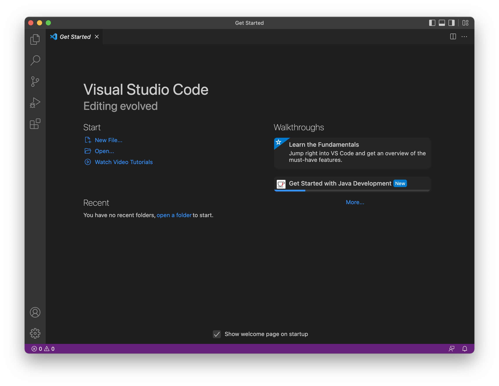
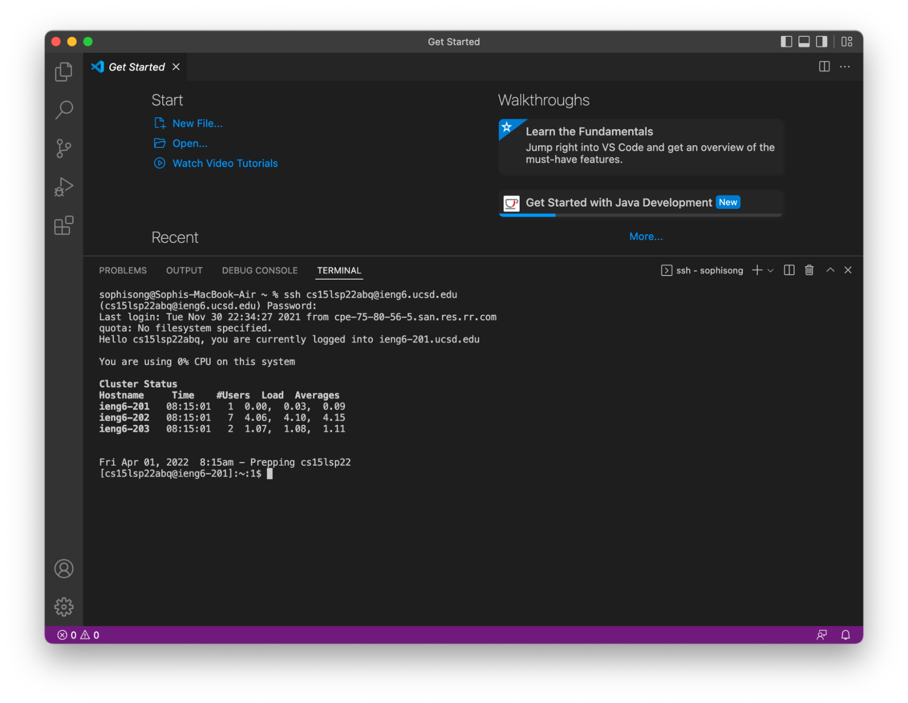
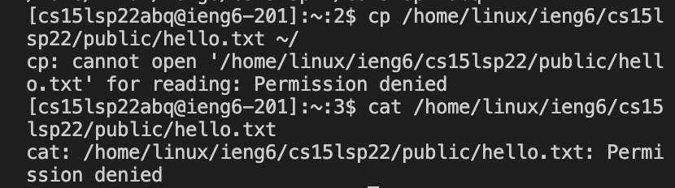
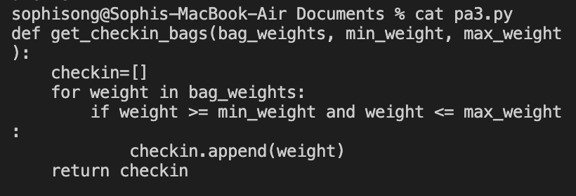
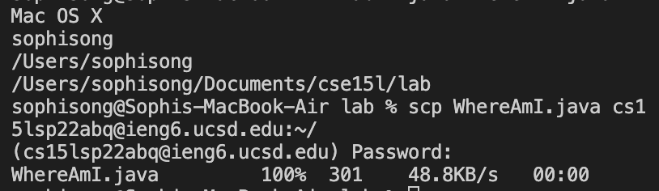
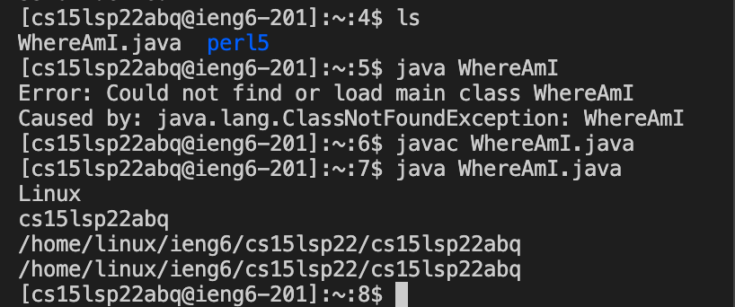
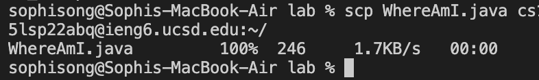

# Lab Report 1
**Tutorial on how to log into a course-specific account on `ieng6`**
## Installing VS Code

1. Go to this [link](https://code.visualstudio.com/) to install Visual Studio Code! 

> Remember to download the correct version that matches your Operating System (Mac/Windows etc.)

2. When you first open VS code on your computer, it should look something like this:


---

## Remotely Connecting
**Let's connect to a remote computer on our local computer!**

> Note: If you're on Windows, make sure to install [OpenSSH](https://docs.microsoft.com/en-us/windows-server/administration/openssh/openssh_install_firstuse) first!*

1. Know your course-specific account information. You'll need the username and password.
2. Open up a terminal in VS code. Type in (fill out the zz according to your username): 
```
$ ssh cs15lsp22zz@ieng6.ucsd.edu
```
3. If connecting to the server, first time. You might see the following message. Say "yes" and type your password:
```
⤇ ssh cs15lsp22zz@ieng6.ucsd.edu
The authenticity of host 'ieng6.ucsd.edu (128.54.70.227)' can't be established.
RSA key fingerprint is SHA256:ksruYwhnYH+sySHnHAtLUHngrPEyZTDl/1x99wUQcec.
Are you sure you want to continue connecting (yes/no/[fingerprint])?
```
4. After that, it shoud look something like this: 

---

## Trying out Commands!
1. Run commands like `cd, ls, pwd, mkdir, and cp` on the local and remote computer. And see what you can access!

2. Here's an example of me using the "cat" and "cp" command on the public folder of the server: 
Notice how permission was denied for me when I tried accessing the path with "/public"? If you're accessing your individual directory instead of public, it should work out for you.

2. More commands to try out:


* cd ~
* cd
* ls -lat
* ls -a
* ls <directory> where <directory> is /home/linux/ieng6/cs15lsp22/cs15lsp22abc, where the abc is one of the other group members’ username
* cp /home/linux/ieng6/cs15lsp22/public/hello.txt ~/
* cat /home/linux/ieng6/cs15lsp22/public/hello.txt

---

## Moving Files with scp
1. Create a file on your local computer. Then, in the terminal, type (You will have to input password again for this step): 
`scp <filename> cs15lsp22zz@ieng6.ucsd.edu:~/`
2. After logging into `ieng6`, use the command "ls" to check whether the file is in your home directory.

Example:

(**On local Computer**)


(**On Server**) 


---

## Setting an SSH key
**All this logging in and inputting password each time can be annoying. We could use an SSH key to skip this repition.**

1. On your local computer. Use the following command: `ssh-keygen`. Make sure that you do not add a passphrase when asked:
```
$ ssh-keygen
Generating public/private rsa key pair.
Enter file in which to save the key (/Users/<user-name>/.ssh/id_rsa): /Users/<user-name>/.ssh/id_rsa
Enter passphrase (empty for no passphrase): 
Enter same passphrase again: 
Your identification has been saved in /Users/<user-name>/.ssh/id_rsa.
Your public key has been saved in /Users/<user-name>/.ssh/id_rsa.pub.
The key fingerprint is:
SHA256:jZaZH6fI8E2I1D35hnvGeBePQ4ELOf2Ge+G0XknoXp0 <user-name>@<system>.local
The key's randomart image is:
+---[RSA 3072]----+
|                 |
|       . . + .   |
|      . . B o .  |
|     . . B * +.. |
|      o S = *.B. |
|       = = O.*.*+|
|        + * *.BE+|
|           +.+.o |
|             ..  |
+----[SHA256]-----+
```

2. Now copy the key to your .ssh directory on server:

```
$ ssh cs15lsp22zz@ieng6.ucsd.edu
<Enter Password>
# now on server
$ mkdir .ssh
$ <logout>
# back on client
$ scp /Users/<user-name>/.ssh/id_rsa.pub cs15lsp22zz@ieng6.ucsd.edu:~/.ssh/authorized_keys
# You use your username and the path you saw in the command above
```
3. try ssh or scp again. You should be able to access server without typing your password, like so:


---

## Optimize Remote Running
1. You can optimize remote running by using helpful tools like the quotation mark (which allows you to run commands on remote server when put at the end of ssh command) and semicolon (which allows multiple commands on one line)
2. The upward arrow on your keyboard can allow you to access previous commands.
3. Here's an example for copying a file to server and running it on the server:
```
(upward arrow) 
scp WhereAmI.java cs15lsp22zz@ieng6.ucsd.edu:~/ ; ssh cs15lsp22zz@ieng6.ucsd.edu "javac WhereAmI.java ; java WhereAmI"
(enter)
```