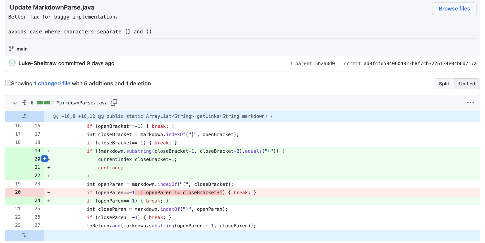
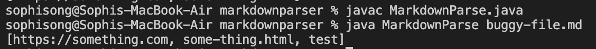
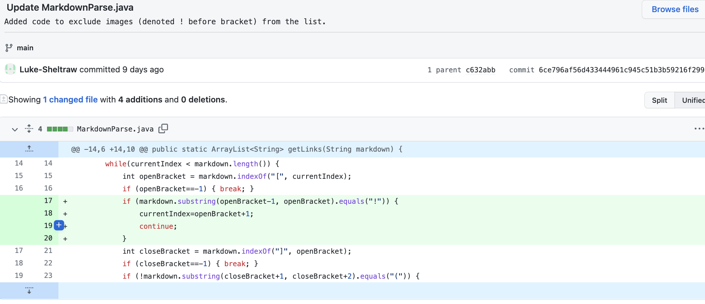
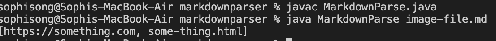
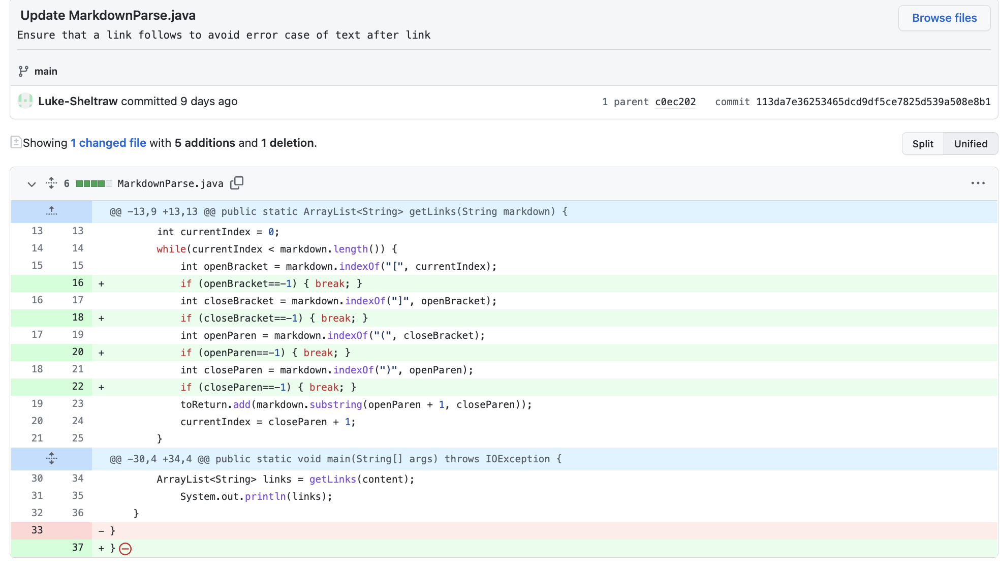
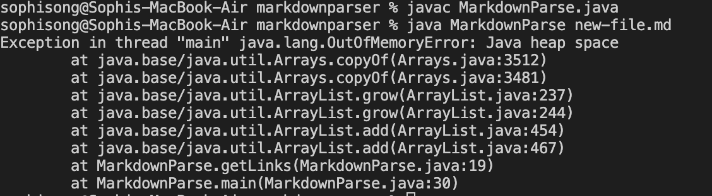

# Lab Report 2

## FIRST BUG: Extra character between [] & () 
Code Change:

[Test file for failure-inducing input](https://github.com/Luke-Sheltraw/markdown-parser/commit/5c6788e3d730249f551e486c65ba7791108f6565)

Buggy output when running the test file in the original version of MarkdownParse.java:

Explanation:
The version of MarkdownParse.java failed to consider cases where there is an extra character between the "[]" and "()", in which the string inside the open parenthesis will be considered as a link URL and be added to the list. 

>For example, the line "[]](test)" in the test file will be considered even though it is not a link.

---
## SECOND BUG: Image files included
Code Change:

[Test file for failure-inducing input](https://github.com/Luke-Sheltraw/markdown-parser/commit/c632abb0bb92bba407beb855cd33a3590394764b)

Buggy output when running the test file in the original version of MarkdownParse.java:

Explanation:
This version of MarkdownParse failed to exclude images from the list. Since the image markdowns are similar to that of link URL, the code will include images.

>For example, in the test file, "https://something.com" is a image. However, the output included it even though it shouldn't.

---
## THIRD BUG: Infinite loop caused by extra text after the link
Code Change:

[Test file for failure-inducing input](https://github.com/Luke-Sheltraw/markdown-parser/commit/c0ec2021c551959d066001ce0e3a9c412b2c6604)

Buggy output when running the test file in the original version of MarkdownParse.java:

Explanation:
This version of MarkdownParse failed to consider cases where there could be text following the links, resulting in an infinite loop.

>For example, in the test file, there is an extra "]" after the last link. Due to the code nature, it keeps detecting link-related symbols and the loop never ends.