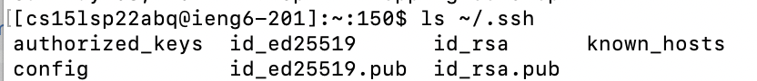

# Lab Report 3

## Streamlining ssh Config

1. I edited my .ssh/config file with my Macbook's terminal

2. I was able to logon to server using the new alias.

3. Example of using scp to copy files with the new alias.

---

## Setup Github Access from ieng6

1. The public key I generated is stored on my Github account and user account(~/.ssh).

2. The private key is stored on the user account as well (along with public key).

3. Now, I tried running git commands on server. First, I cloned one of my repo to my accound, and ran the following command

4. As shown, a "new line" appeared at the end of the java file.

5. Then, I used "git status" to check if it's modified and commit & push the changes. 

6. Here's a link for the resultant modificatioon:
[Click Here](https://github.com/soph-song/Demo1/commit/4167552013404af65f01bd763cbe24abbb9e3dc4)

---

## Copy whole directories with scp -r

1. I copied the whole directory onto my server using "scp -r"

2. Now, I login to my account, compile and run the test on the server

3. Doing step 1 and step 2 in one shot (It's a long list of files that were uploaded, so I'm going to show part of it, the the part where Junit successfully runs)

